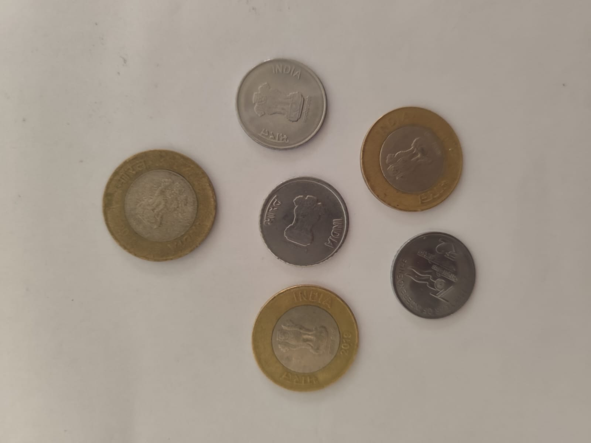
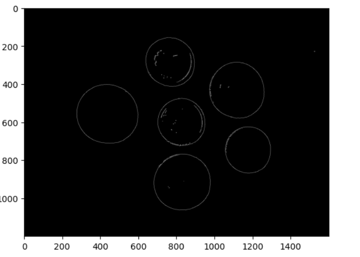
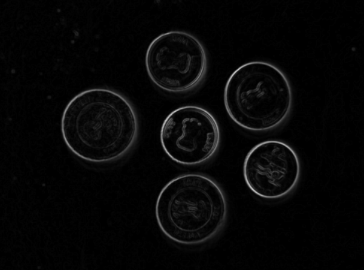
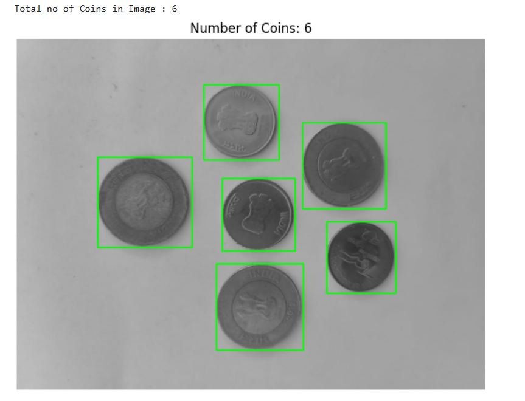
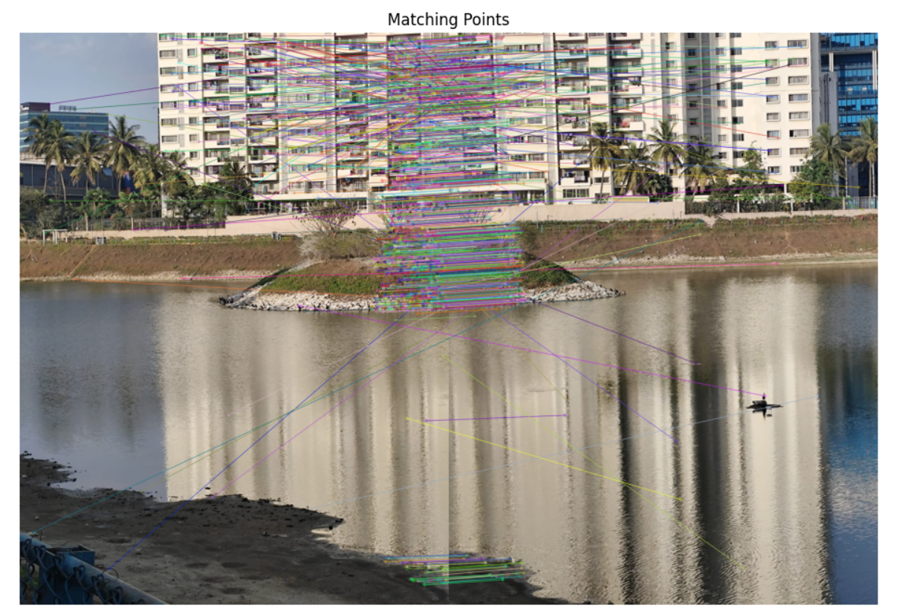
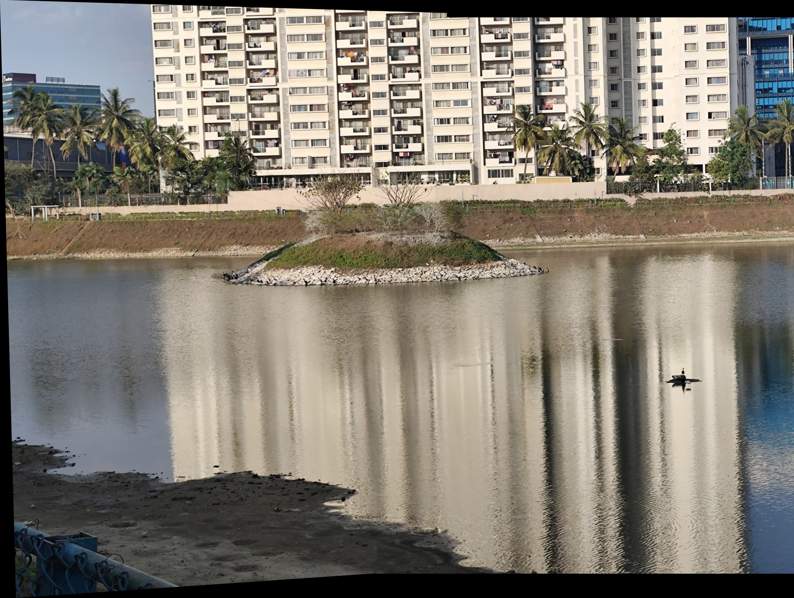

# VR_Assignment1_Akash_Chaudhari_MT2024012

## How to Use  

This repository contains two Jupyter notebooks:  

1. **`Coin_Detection.ipynb`** – Run this notebook to detect and count coins in an image.  
2. **`Panorama_Creation.ipynb`** – Run this notebook to stitch images and create a panorama.  

Open and run the notebooks in Jupyter Notebook or Google Colab to see the output.  

## 

1. **Edge Detection:** Applies Sobel and Canny operators 
to detect edges.
2. **Image Segmentation:** Segments the image using thresholding techniques.
3. **Coin Counting:** Detects and counts coins in the image using contour detection.
4. **Extract Key Points:** Detect key points in overlapping images Using SIFT.
5. **Image Stitching:** Use the extracted key points to align and stitch the images into a single panorama.

## Edge Detection

1. **Load the Image**  

2. **Convert to Grayscale**  

3. **Apply Gaussian Blur**  

4. **Normalize the Image**  

5. **Perform Sobel Edge Detection**  

6. **Apply Thresholding**  

7. **Apply Canny Edge Detection**  

8. **Blend Grayscale and Edge Image**    

9. **Display Results**  

### Output:

  
*Figure 1: Original Image*

  
*Figure 2: Edge detection result using Canny.*

  
*Figure 3: Edge detection result using Sobel.*

## Image Segmentation

1. **Load the Image**  

2. **Convert to Grayscale**  

3. **Normalize the Image**  

4. **Apply Gaussian Blur**  

5. **Apply Thresholding**  

6. **Display Results**  

### Output:

  
*Figure 4: Segmentation*

##  Coins Counting

1. **Load the Image**  

2. **Resize the Image**  - Resize the image to a fixed dimension for uniform processing.  

3. **Convert to Grayscale**   

4. **Normalize Pixel Intensity**  

5. **Apply Gaussian Blur**  

6. **Apply Thresholding**  


7. **Invert the Thresholded Image**  - Perform bitwise inversion to highlight the coin contours.  

8. **Detect Contours**  

9. **Filter Contours Based on Size**  


10. **Count and Highlight Coins**  
   - Count the filtered contours representing coins.  
   - Draw bounding rectangles around detected coins.  

### Output:

  
*Figure 5: Coin Counting*


## Key Point Detection and Matching using SIFT  

1. **Convert Images to Grayscale**  - Convert both input images to grayscale for feature extraction.  

2. **Initialize SIFT Detector**  - Create a SIFT detector to extract key points and descriptors.  

3. **Compute Key Points and Descriptors**  - Detect key points and compute descriptors for both grayscale images.  

4. **Initialize BFMatcher**  - Use a **Brute-Force Matcher (BFMatcher)** with L2 norm to compare descriptors.  

5. **Find Matches Using KNN Matching**  - Find the two best matches for each descriptor using **knnMatch**.  

6. **Apply Lowe's Ratio Test**  - Filter good matches by keeping only those where the closest match is significantly better than the second-closest.  

7. **Display Matched Key Points**  

### Output:
  
*Figure 6: Matching Points*

## Image Stitching Steps  

1. **Convert to Grayscale** – Convert both images to grayscale.  
2. **Detect Features** – Use SIFT to extract key points and descriptors.  
3. **Match Features** – Use BFMatcher with KNN to find good matches.  
4. **Filter Matches** – Apply Lowe’s ratio test to keep the best matches.  
5. **Find Homography** – Compute the transformation.  
6. **Warp Image** – Transform the first image to align with the second.  
7. **Merge Images** – Overlay and blend both images into a panorama.  
8. **Output Panorama** – Return the final stitched image.  

### Output


  
*Figure 6: Original Image 1*


  
*Figure 7: Original Image 2*

  
*Figure 8: Panorama Image*


## Requirements

- Python 3.x
- OpenCV (`opencv-python`)
- NumPy
- Matplotlib

You can install the dependencies via pip:

```bash
pip install opencv-python numpy matplotlib